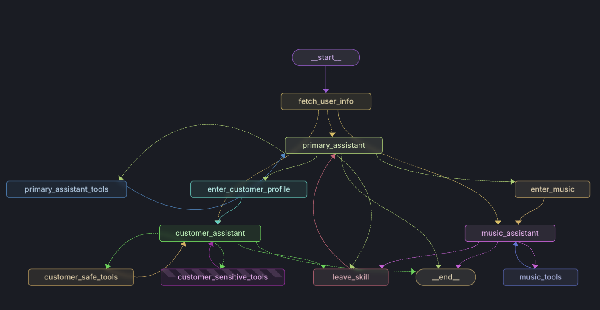

# Music Store AI Assistant

## Overview
The **Music Store AI Assistant** is a multi-agent conversational system designed to assist customers with music-related queries and profile management. Built using **LangGraph**, **LangChain**, and **OpenAI models**, it leverages a structured state graph to dynamically route user interactions between a **primary assistant**, a **customer profile assistant**, and a **music recommendation assistant**.

This system integrates:
- **Conversational AI** powered by OpenAI models.
- **State management** using LangGraph for dynamic conversation flow.
- **SQL database** for customer and music data retrieval.
- **Vector search** for approximate music recommendations.

## Architecture
The assistant operates via a structured state graph, handling different user intents by transitioning between specialized assistants. Below is the architecture visualization:



### Workflow
1. **User Message Handling**:
   - The assistant processes user messages and determines the intent.
   - Routes queries to the appropriate workflow (music recommendation, customer profile, or general assistance).
2. **Tool Execution**:
   - Executes SQL queries for customer data retrieval and updates.
   - Uses vector search for artist and song recommendations.
3. **State Transitions**:
   - Conversations follow a state-driven flow using LangGraph, ensuring appropriate routing and transitions.

## Repository Structure
```
.
├── README.md                 # Project documentation
├── app                       # Core application
│   ├── agent                 # Main AI assistant implementation
│   │   ├── agent.py          # Core logic for the conversational agent
│   │   ├── main.py           # Entry point for running the assistant
│   │   ├── requirements.txt  # Dependencies for the agent
│   │   ├── logs              # Application logs
│   │   └── utils             # Helper modules
│   │       ├── logger.py     # Logging setup
│   │       ├── nodes.py      # Graph nodes for state transitions
│   │       ├── state.py      # Conversation state management
│   │       └── tools.py      # Database and retrieval tools
│   ├── config.json           # Configuration settings
│   └── langgraph.json        # LangGraph workflow definition
├── data                      # Data storage
│   ├── chinook.db            # SQLite database for music store
│   └── config.json           # Additional configuration
├── docs                      # Documentation and visualizations
│   ├── architecture.md       # Detailed architecture documentation
│   ├── v2_graph_visualization.png # State graph visualization
│   └── visualizations        # Images for project documentation
│       ├── conversation_graph.png
│       ├── langgraph_studio.png
│       └── v2_graph_visualization.png
├── logs                      # Logging directory
│   └── langsmith_traces      # LangSmith traces for debugging
├── notebooks                 # Jupyter notebooks for development & analysis
│   ├── chinook.db
│   ├── config.json
│   ├── main.py
│   └── multi_agent_framework.ipynb
├── requirements.txt          # Project dependencies
└── tests                     # Test suite
    ├── test_agent.py         # Tests for agent functionality
    ├── test_nodes.py         # Tests for graph nodes
    └── test_tools.py         # Tests for tool execution
```

## Setup Instructions
### 1. Install Dependencies
```bash
pip install -r requirements.txt
```

### 2. Configure Environment Variables
Create a `.env` file in the project root and set:
```env
MODEL_NAME=gpt-4-turbo-preview
TEMPERATURE=0
STREAMING=True
```

### 3. Run the Assistant
```bash
python app/agent/main.py
```

### 4. Run Tests
```bash
pytest tests/
```

## Key Features
- **Modular AI Assistants**: Separate agents for primary handling, music recommendations, and customer profile management.
- **Dynamic Routing**: Uses state-based decision-making to route conversations effectively.
- **Database Integration**: Retrieves and updates customer and music data in real-time.
- **Vector Search for Music**: Approximate matching for artist and track retrieval.
- **Error Handling & Logging**: Logs errors and tool execution traces for debugging.

## Future Enhancements
- Expand the music recommendation capabilities.
- Improve security around customer profile updates.
- Enhance conversation flow using memory retention.

---
Developed by James Liounis


